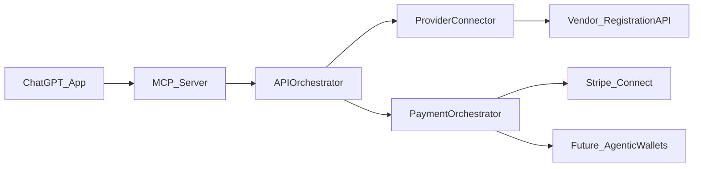

# Agentic Payment Flows Roadmap (SignupAssist)

## What this document is

A plan for evolving SignupAssist from “book via API + success fee” into **agent-compatible payments** where users can pay (program fee and/or SignupAssist fee) with emerging “agentic payment” rails—while staying **API-only** and compatible with ChatGPT Apps constraints.

## Current state (today)

- **Program fee**: typically collected by the provider/platform (Bookeo/provider MoR).
- **SignupAssist fee**: collected by SignupAssist via Stripe (success-fee model).
- **Core flow**: chat → discovery → required fields → booking API call → receipt.

## Goal state (future)

Support multiple payment outcomes, capability-gated per provider/vendor:

- **A: Book now, pay later** (vendor invoices later) — still “full signup” if booking is confirmed.
- **B: Book now + external pay link** (provider checkout link) — acceptable in ChatGPT Apps.
- **C: Book now + in-chat payment authorization** (agentic payments) — user approves payment in a native wallet/flow.

We design for C without blocking A/B.

## Constraints (important for ChatGPT Apps)

- **API-only**: no RPA/scraping.
- **No raw card data**: tokenized payments only.
- **Deterministic consent & audit**: payment authorization must be attributable to a user, time-bounded, and replay-safe (idempotent).
- **UI limitations**: ChatGPT may only support plain text + occasional external URL actions; don’t rely on embedded checkout widgets inside chat.

## Recommended default rail: Stripe Connect (marketplace pattern)

Even if “program fee happens outside of SignupAssist”, Stripe Connect is the most scalable way to support in-chat program-fee capture later.

### Why Stripe Connect

- Vendors stay **merchant of record** on their connected Stripe account.
- SignupAssist can take an **application fee** (or separately charge the success fee).
- Avoids us “taking custody” of funds (reduces money-transmitter risk vs collecting-and-forwarding).

### Two payment models to support

- **Separate charges** (simplest alignment with current model)
- Charge vendor program fee on connected account
- Charge SignupAssist success fee on platform account
- **Single charge w/ application fee** (best UX)
- One PaymentIntent on connected account
- `application_fee_amount` routes our fee to SignupAssist

We should support both; choose per vendor/provider.

## Architecture: Payment Orchestration as a capability layer

Introduce an internal “payments capability” abstraction so new agentic rails can plug in later.

### Key objects (internal)

- **PaymentQuote**: amounts, currency, fee breakdown, merchant, refund policy summary.
- **PaymentAuthorization**: user consent artifact, scope, expiry (reuse your existing mandate concept).
- **PaymentExecution**: idempotency key, provider, status, receipt IDs.

### Where this likely lives

- Orchestration: `mcp_server/ai/APIOrchestrator.ts`
- Payments: new module in `core/billing/` (or `mcp_server/payments/`) to keep provider connectors clean
- Audit/consent: extend existing `mandates.*` tools and DB records

## Agentic payments: how to stay future-proof

We should treat “agentic payment flows” as **payment method token sources + user consent UX**, not as a rewrite.Design principle:

- Our system should accept a **payment method token** (or a reference) and a **signed consent** (mandate) and then execute via the chosen rail.

When OpenAI/Google/Visa/Mastercard agentic rails mature, integration should look like:

- User authorizes payment in their native flow
- We receive token/reference + consent
- We execute a Stripe PaymentIntent (or equivalent) with that token

## Rollout plan (phased)

### Phase 0 (now): normalize fee + payment messaging

- Standardize how we describe: program fee vs SignupAssist fee, and who is MoR.

### Phase 1: Stripe Connect program-fee capture (pilot)

- Add capability flag per vendor: `supports_in_app_program_fee`
- Implement PaymentIntent-on-connected-account
- Keep external pay link fallback

### Phase 2: “agentic-ready” consent + idempotency

- Make mandates first-class for payment actions (scopes, expiry, replay protection)
- Store a payment receipt record tied to booking

### Phase 3: add additional payment token sources

- Add new payment token providers behind the same `PaymentOrchestrator` interface

## Vendor onboarding requirements (for in-app program fee)

- Vendor agrees to Stripe Connect onboarding
- Vendor defines refund/cancellation policy (exposed in chat before payment)
- Vendor provides product catalog mapping + registration endpoint credentials

## Key risks and mitigations

- **Regulatory / MoR ambiguity**: prefer Stripe Connect so vendor is MoR.
- **Refunds**: define which portion is refundable (program fee vs success fee) and implement separately.
- **Chargebacks**: ensure chargeback handling routes to vendor when vendor is MoR.

## Implementation todos

- **payments-abstraction**: Define `PaymentQuote/Authorization/Execution` interfaces and storage.
- **stripe-connect-pilot**: Implement connected-account program-fee capture + application fee option.
- **consent-mandates**: Extend mandate model to cover payment scopes + idempotency.