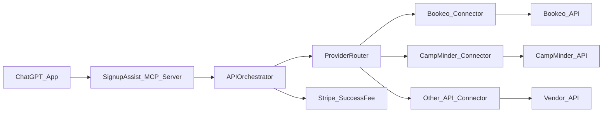

# API-only Integration System (End-to-end Signup)

## Outcome we’re optimizing for

- **Supply growth**: add many vendors quickly once a platform (Bookeo/CampMinder/etc) is integrated.
- **End-to-end in chat**: user can discover classes and complete registration via our app.
- **API-only**: no scraping/RPA.
- **Payment (MVP)**: **seat is confirmed via API**; **external provider payment link is acceptable**; we still collect our success fee.

## Key insight: separate “platform integrations” from “vendor onboarding”

- **Platform integration (1× per SaaS)**: build a connector once for Bookeo, CampMinder, etc.
- **Vendor onboarding (N× per business)**: add a new vendor mostly by config + credentials + mapping—no new code.

## Standard connector contract (what every integration must support)

Define a strict “provider capability contract” (internally and in docs) with **versioning** and **conformance tests**.**Required capabilities (API-only, full signup flow):**

- **Catalog**: list programs/classes + sessions/events + pricing + availability windows.
- **Schema**: discover required fields for registration (guardian/participant/custom questions).
- **Registration**: create/confirm booking (or equivalent) and return a stable booking/registration identifier.
- **Cancellation**: cancel booking and return updated state.
- **Idempotency**: safe retries (client + server) for create/cancel.

**Optional capabilities (for better UX):**

- Holds/reservations, waitlists, partial payments, refunds, payment status, webhooks.

## Architecture: “hub” MCP server + provider connectors

Your MCP server remains the single ChatGPT-facing surface (`signupassist.chat`), while provider integrations are modular.

**Where this lives in code today (and should evolve):**

- Provider connectors: `mcp_server/providers/` (e.g. `mcp_server/providers/bookeo.ts`)
- Orchestration + flow: `mcp_server/ai/APIOrchestrator.ts`
- Org/vendor configuration: `mcp_server/config/organizations.ts` (move toward DB-backed onboarding)

## Payment strategy (matches your constraints)

### Default (max supply): vendor is MoR, we charge success fee

- **Registration confirmed via provider API**.
- **Program fee handled by provider** (can be “pay later” or external link).
- **SignupAssist charges success fee** only after confirmed registration (current model).

### Upgrade path: in-chat program fee via Stripe Connect (when available)

- For vendors willing to use **Stripe Connect**, we can capture program fee in-chat:
- PaymentIntent on **vendor connected account**
- `application_fee_amount` for SignupAssist
- Funds settle to vendor; our fee routes to us.
- This is optional and should be capability-gated per provider/vendor.

## “Hybrid” integration program (systematic onboarding)

### Track A: We build+host major connectors

- Bookeo-like schedulers
- CampMinder
- School/community-ed systems **only if official APIs exist**

### Track B: Vendor builds against our spec (for long tail)

- Publish a **Partner Integration Spec** (OpenAPI + examples) that vendors can implement.
- Provide a lightweight **SDK** and a **self-test harness**.
- Vendors get “certified” once they pass contract tests.

## Third-party tools: what helps vs what doesn’t

- **Stripe Connect**: strongly recommended (you already chose this) for scalable payouts/fees.
- **Segment/RudderStack**: useful for growth analytics (funnel, vendor conversion), not for completing registrations.
- **Observability**: Sentry + OpenTelemetry (or Datadog) is high ROI because integrations fail in the wild.
- **Integration platforms (Zapier/Workato/etc)**: generally **not** ideal for “real-time, high-integrity booking” flows; keep core booking paths in first-party code.

## Roadmap (next ~8 weeks, aligned with your priorities)

- **Week 1–2: Connector contract + test harness**
- Define canonical objects (Program, Session, RequiredFields, BookingReceipt)
- Build contract tests for: list → discoverFields → book → cancel
- **Week 2–4: Bookeo hardening + multi-vendor credentialing**
- Move from single-account env keys to per-vendor credentials + capability flags
- **Week 3–6: CampMinder API integration**
- Implement the same contract; ship 1–2 pilot vendors
- **Week 5–8: “School/district system” pilot (API-only)**
- Pick one system with real APIs and run a pilot end-to-end

## Partner/business motion (to scale supply)

- Create a **Partner API Access Pack**: security questionnaire, scopes needed, sandbox requirements, expected SLAs.
- Offer two options:
- “Give us API keys + Stripe Connect, we integrate you” (fastest)
- “Implement our spec and certify” (for platforms/vendors who want control)

## Implementation todos

- **connector-contract**: Define and version the provider connector contract + capability matrix.
- **credentialing**: Add per-vendor credential storage + admin onboarding workflow.
- **contract-tests**: Build automated contract tests and a certification checklist.
- **campminder-connector**: Implement CampMinder connector to the contract.