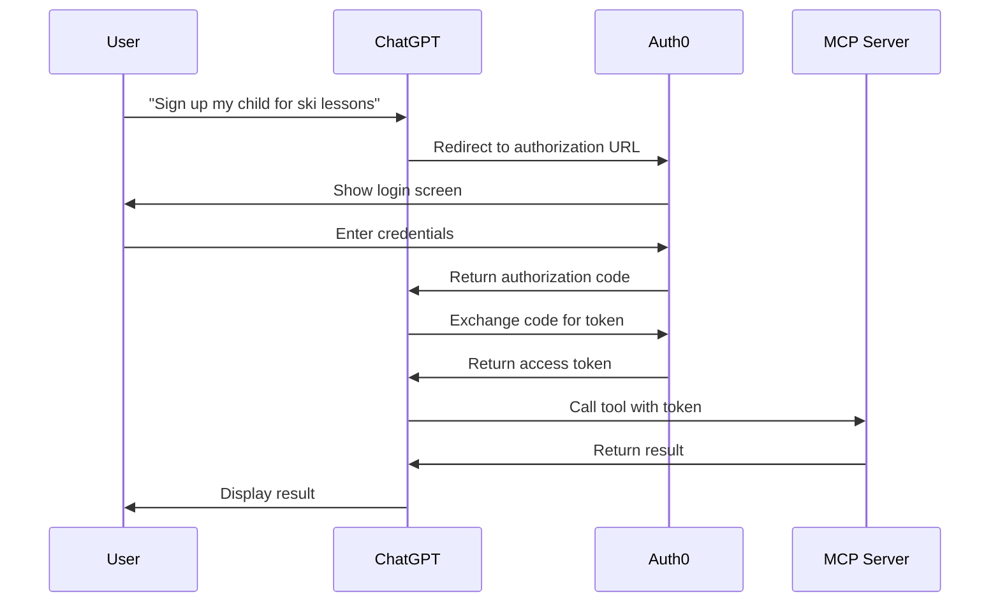

# ChatGPT Integration Guide

This guide covers the complete process of integrating SignupAssist with ChatGPT as a Custom GPT or GPT App Store submission.

## Table of Contents

1. [Overview](#overview)
2. [OpenAPI Specification](#openapi-specification)
3. [OAuth Configuration](#oauth-configuration)
4. [Creating a Custom GPT](#creating-a-custom-gpt)
5. [Testing Integration](#testing-integration)
6. [Maintenance](#maintenance)
7. [GPT Store Submission](#gpt-store-submission)
8. [Troubleshooting](#troubleshooting)

---

## Overview

SignupAssist integrates with ChatGPT via:
- **OpenAPI 3.1 Specification**: Describes available tools and parameters
- **OAuth 2.0 (Auth0)**: Secures user authentication
- **MCP Server**: Production-ready at `https://signupassist-mcp-production.up.railway.app`

### Available Tools

| Tool | Description |
|------|-------------|
| `scp.find_programs` | Search available programs at an organization |
| `scp.discover_required_fields` | Discover form fields for registration |
| `scp.login` | Authenticate with provider credentials |
| `scp.register` | Register a child for a program |
| `scp.pay` | Process payment for registration |
| `scp:list_children` | List registered children |
| `scp:check_prerequisites` | Verify account readiness |
| `scp.check_account_status` | Check account status |
| `scp.check_membership_status` | Check membership validity |
| `scp.check_payment_method` | Verify payment method |

---

## OpenAPI Specification

### Generating the Spec

The OpenAPI spec is auto-generated from tool definitions:

```bash
# Generate OpenAPI spec
npm run openapi:generate

# Output: mcp/openapi.json
```

### Serving the Spec

The MCP server serves the spec at:
```
https://signupassist-mcp-production.up.railway.app/mcp/openapi.json
```

**Local testing:**
```bash
# Start local MCP server
npm run mcp:start

# Test endpoint
curl http://localhost:8080/mcp/openapi.json
```

### Versioning

The spec follows semantic versioning:
- **Major**: Breaking changes (removed tools, changed parameters)
- **Minor**: New tools or optional parameters
- **Patch**: Documentation or non-breaking updates

Version info is tracked in `mcp/.openapi-version`:
```json
{
  "version": "1.0.0",
  "generatedAt": "2025-01-15T12:00:00Z",
  "toolCount": 10
}
```

---

## OAuth Configuration

### Auth0 Setup

**Application Settings** (must be configured in Auth0 dashboard):

1. **Application Type**: Regular Web Application

2. **Allowed Callback URLs**:
   ```
   https://oauth.openai.com/v1/callback
   https://chat.openai.com/aip/callback
   ```

3. **Allowed Web Origins**:
   ```
   https://chat.openai.com
   ```

4. **Token Endpoint Authentication Method**: POST

5. **Scopes**:
   - `user` - Access user data and perform actions

### OAuth Flow



### Testing OAuth Locally

```bash
# Test authorization URL
open "https://dev-33ngu1de5cxjtxyd.us.auth0.com/authorize?response_type=code&client_id=YOUR_CLIENT_ID&redirect_uri=https://oauth.openai.com/v1/callback&scope=user"

# Exchange code for token
curl -X POST https://dev-33ngu1de5cxjtxyd.us.auth0.com/oauth/token \
  -H 'Content-Type: application/json' \
  -d '{
    "grant_type": "authorization_code",
    "client_id": "YOUR_CLIENT_ID",
    "client_secret": "YOUR_CLIENT_SECRET",
    "code": "AUTHORIZATION_CODE",
    "redirect_uri": "https://oauth.openai.com/v1/callback"
  }'
```

---

## Creating a Custom GPT

### Step 1: Create GPT

1. Go to [ChatGPT](https://chat.openai.com)
2. Click your profile → "My GPTs" → "Create a GPT"
3. Configure:
   - **Name**: SignupAssist
   - **Description**: Automates activity registration with secure credential management
   - **Instructions**: (See [GPT Instructions](#gpt-instructions))

### Step 2: Add Action

1. Click "Configure" → "Create new action"
2. **Authentication type**: OAuth
3. **OpenAPI Schema URL**:
   ```
   https://signupassist-mcp-production.up.railway.app/mcp/openapi.json
   ```
4. **OAuth Settings**:
   - Client ID: `[From Auth0]`
   - Client Secret: `[From Auth0]`
   - Authorization URL: `https://dev-33ngu1de5cxjtxyd.us.auth0.com/authorize`
   - Token URL: `https://dev-33ngu1de5cxjtxyd.us.auth0.com/oauth/token`
   - Scope: `user`

### GPT Instructions

```
You are SignupAssist, an automated activity registration assistant. You help parents sign up their children for activities by:

1. Searching for available programs
2. Checking prerequisites and account status
3. Discovering required registration fields
4. Completing registration forms
5. Processing payments securely

**Before taking any action, you MUST:**
- Verify user consent for credential access
- Explain what data will be accessed
- Confirm the mandate scope (program, amount limits)

**Tool Usage Guidelines:**
- Always start with `scp.find_programs` to discover available programs
- Use `scp:check_prerequisites` before registration
- Call `scp.discover_required_fields` to understand form requirements
- Never process payments without explicit user confirmation

**Security:**
- All credentials are stored encrypted
- You never see or handle actual passwords
- Payment processing uses tokenized methods
- Full audit trail is maintained

**Example Workflow:**
User: "Sign up my child for Blackhawk ski lessons"
1. Call `scp.find_programs` with organization_id="blackhawk", query="ski lessons"
2. Present options to user
3. User selects program
4. Call `scp:check_prerequisites` to verify readiness
5. Call `scp.discover_required_fields` to get form
6. Collect required data from user
7. Call `scp.register` with form_data
8. Confirm success or handle errors

Always be conversational, clear, and prioritize user consent.
```

### Presenting Consent to Users

**Two-Tier Mandate System:**

SignupAssist uses a two-tier mandate system to balance user friction and explicit consent:

**1. Discovery Mandate (Auto-Created After OAuth):**
- **Purpose**: Browse programs and check prerequisites
- **Scope**: `['scp:read:listings', 'scp:authenticate']`
- **Duration**: 24 hours
- **Creation**: Automatically created after successful OAuth login
- **User Friction**: Low - brief confirmation message shown after OAuth

After successful OAuth, immediately show the discovery consent message:

```typescript
// Auto-create discovery mandate after OAuth
const discoveryMessage = `
🔐 Browsing Permissions Granted

You're connected! I can now help you browse programs.

**What I can do right now:**
• Browse available programs and their details
• Check prerequisites for your account
• Answer questions about registration options

**What I CAN'T do (yet):**
• Submit registrations
• Process payments
• Modify your account

These permissions last for 24 hours so we can help you explore options freely.

Ready to find a program? Just tell me what you're looking for!
`;
```

**2. Execution Mandate (User-Triggered, Explicit Consent):**
- **Purpose**: Complete registration and payment
- **Scope**: `['scp:authenticate', 'scp:register', 'scp:payment']`
- **Duration**: Valid until registration window (e.g., 7am on Jan 20)
- **Creation**: User must explicitly authorize with "authorize" response
- **User Friction**: One-time comprehensive consent required

When user confirms they want to register, show the full execution consent:

```typescript
// Only create execution mandate after explicit user authorization
const executionMessage = `
🎯 Authorization Required

Ready to set up automatic registration for Emma in Beginner Alpine ($125)?

**🔐 Authorization & Consent**

✓ **What we're asking permission for:**
  By authorizing this plan, you allow SignupAssist to:
  • Log into your account when registration opens
  • Fill out and submit the registration form for Emma
  • Process payment up to $150 using your saved payment method

✓ **How it works:**
  We create a cryptographically signed "mandate" (permission token)
  that authorizes these specific actions. This mandate is valid until
  Jan 20, 2025 at 7:00 AM and cannot be reused after that.

✓ **Security guarantees:**
  • Your credentials are encrypted end-to-end
  • We never see your full credit card number
  • Registration happens in an isolated browser session
  • Session is destroyed immediately after completion

✓ **Full transparency:**
  Every action is logged in your audit trail, including:
  • When the mandate was issued
  • What actions were attempted
  • Screenshots of key moments (form filled, confirmation)
  • Final outcome (success or any blockers)
  
  [View your audit trail →](/mandates-audit)

✓ **Your control:**
  • You can revoke this at any time from your audit trail
  • Mandate expires automatically after registration
  • If we hit a blocker (CAPTCHA, new waiver), we'll pause and notify you

💰 **Cost Limit:** $150
⏰ **Valid Until:** Jan 20, 2025 at 7:00 AM

Say "authorize" to proceed, or "cancel" to stop.
`;

// Wait for explicit "authorize" or "yes" response before creating mandate
```

**Implementation Guidelines:**
- Discovery mandates are created server-side after OAuth and stored in ChatGPT context
- Execution mandates require explicit user confirmation via "authorize" keyword
- Both mandate types appear in `/mandates-audit` with distinct badges
- Audit trail shows which tier of mandate authorized each action
- Users can revoke either type of mandate at any time

---

## Testing Integration

### Test Cases

#### 1. Program Discovery
```
User: "Find ski programs at Blackhawk"

Expected:
- ChatGPT calls scp.find_programs
- Returns list of programs
- User can select one
```

#### 2. Prerequisites Check
```
User: "Am I ready to register?"

Expected:
- ChatGPT calls scp:check_prerequisites
- Checks account, membership, payment method
- Informs user of missing items
```

#### 3. Full Registration Flow
```
User: "Register my daughter for Winter Lessons at Blackhawk"

Expected:
1. Find programs
2. Check prerequisites
3. Discover required fields
4. Collect form data
5. Complete registration
6. Process payment
7. Show confirmation
```

### Validation Checklist

- [ ] All 10 tools are callable from ChatGPT
- [ ] OAuth flow completes successfully
- [ ] Mandate creation is tracked in database
- [ ] Audit trail shows all tool calls
- [ ] Error messages are user-friendly
- [ ] Payment processing requires explicit confirmation
- [ ] Credential access requires user consent

### Debugging Tools

**Check MCP Server Logs:**
```bash
# Railway logs
railway logs --follow

# Local logs
npm run mcp:start
```

**Check Database Audit Trail:**
```sql
-- View recent tool calls
SELECT * FROM audit_log 
ORDER BY created_at DESC 
LIMIT 10;

-- View mandate history
SELECT * FROM mandates 
WHERE user_id = 'USER_ID' 
ORDER BY created_at DESC;
```

**Test Tool Directly:**
```bash
curl -X POST https://signupassist-mcp-production.up.railway.app/tools/call \
  -H 'Authorization: Bearer YOUR_TOKEN' \
  -H 'Content-Type: application/json' \
  -d '{
    "tool": "scp.find_programs",
    "args": {
      "session_id": "test-123",
      "mandate_id": "550e8400-e29b-41d4-a716-446655440000",
      "organization_id": "blackhawk"
    }
  }'
```

---

## Maintenance

### When to Regenerate OpenAPI Spec

Regenerate when:
- Adding new tools
- Changing tool parameters
- Modifying authentication
- Updating server URL

**Automated regeneration** (recommended):
```json
// package.json
{
  "scripts": {
    "predeploy": "npm run openapi:generate"
  }
}
```

### Updating Tool Definitions

1. Edit `mcp_server/providers/skiclubpro.ts`
2. Run `npm run openapi:generate`
3. Review changes in `mcp/openapi.json`
4. Commit and deploy to Railway
5. Update ChatGPT action if breaking changes

### Version Management

```bash
# Check current version
cat mcp/.openapi-version

# Force version bump (for breaking changes)
# Edit mcp/.openapi-version manually:
{
  "version": "2.0.0",
  "generatedAt": "2025-01-15T12:00:00Z",
  "toolCount": 11
}

# Regenerate spec
npm run openapi:generate
```

---

## GPT Store Submission

### Prerequisites

- [ ] OpenAPI spec is publicly accessible
- [ ] OAuth flow is fully tested
- [ ] Privacy policy URL is active
- [ ] Terms of service URL is active
- [ ] Demo credentials are available
- [ ] App logo is uploaded (512x512px)
- [ ] Short description (60 chars) is clear
- [ ] Full description is comprehensive

### Submission Checklist

1. **Functionality**
   - All tools work end-to-end
   - Error handling is graceful
   - User feedback is clear

2. **Security**
   - OAuth is properly configured
   - Credentials are encrypted
   - Audit trail is complete
   - GDPR compliance is documented

3. **Documentation**
   - README.md is complete
   - API reference is clear
   - Use cases are documented
   - Troubleshooting guide exists

4. **Testing**
   - Happy path tested
   - Error cases handled
   - Edge cases covered
   - Performance is acceptable

### Review Process

1. Submit via ChatGPT GPT Store
2. OpenAI reviews submission (1-2 weeks)
3. Address any feedback
4. Approval or rejection notification
5. Public listing (if approved)

### Demo Credentials

Provide test credentials for reviewers:
```
Organization: Blackhawk Ski Club
Email: demo@signupassist.ai
Password: [Provided separately to OpenAI]
Test Program: Winter Lessons 2025
```

---

## Troubleshooting

### Common Issues

#### 1. OAuth Authentication Fails

**Symptoms:**
- "Unauthorized" error
- Token exchange fails
- Redirect loop

**Solutions:**
- Verify callback URLs in Auth0
- Check client ID and secret
- Ensure scope is `user`
- Test OAuth flow manually

#### 2. Tool Calls Return 404

**Symptoms:**
- "Tool not found" error
- 404 from MCP server

**Solutions:**
- Verify tool name matches spec exactly
- Check OpenAPI spec is accessible
- Regenerate spec if tools changed
- Verify server URL is correct

#### 3. Mandate Verification Fails

**Symptoms:**
- "Mandate not found" error
- "Insufficient permissions" error

**Solutions:**
- Check mandate exists in database
- Verify user owns mandate
- Ensure mandate is not expired
- Check amount limits

#### 4. Form Discovery Fails

**Symptoms:**
- "Could not discover fields" error
- Empty form schema returned

**Solutions:**
- Verify program exists
- Check browser session is active
- Ensure correct organization_id
- Test with simpler program first

### Error Codes

| Code | Meaning | Action |
|------|---------|--------|
| 400 | Invalid request | Check parameter types |
| 401 | Unauthorized | Verify OAuth token |
| 403 | Forbidden | Check mandate permissions |
| 404 | Not found | Verify IDs are correct |
| 429 | Rate limit | Wait and retry |
| 500 | Server error | Check MCP server logs |

### Support Resources

- **Documentation**: https://github.com/signupassist/signupassist
- **Discord**: [Join our community]
- **Email**: support@signupassist.ai
- **Railway Status**: https://status.railway.app

---

## Next Steps

1. ✅ **Complete OAuth setup** in Auth0
2. ✅ **Generate OpenAPI spec** via CLI
3. ✅ **Test locally** with curl
4. ✅ **Create Custom GPT** in ChatGPT
5. ✅ **Test integration** with real data
6. ✅ **Document findings** in this guide
7. ⬜ **Submit to GPT Store** when ready

---

## Appendix

### OpenAPI Schema Reference

The full schema is auto-generated in `mcp/openapi.json`. Key sections:

- **Info block**: Title, version, description
- **Servers**: Production URL
- **Paths**: `/tools/call` endpoint
- **Schemas**: Input/output for each tool
- **Security**: OAuth 2.0 configuration

### Tool Parameter Reference

| Tool | Required Parameters | Optional Parameters |
|------|-------------------|-------------------|
| `scp.find_programs` | session_id, mandate_id, organization_id | query |
| `scp.discover_required_fields` | session_id, mandate_id, program_id, organization_id | - |
| `scp.login` | session_id, mandate_id, organization_id, credential_id | - |
| `scp.register` | session_id, mandate_id, program_id, organization_id, form_data | child_id |
| `scp.pay` | session_id, mandate_id, organization_id, amount | payment_method_id |

### Audit Trail Schema

```typescript
interface AuditLog {
  id: string;
  mandate_id: string;
  tool: string;
  args: Record<string, any>;
  result: Record<string, any>;
  error?: string;
  created_at: string;
  user_id: string;
}
```

---

**Last Updated**: 2025-01-15
**Version**: 1.0.0
**Maintainer**: SignupAssist Team
