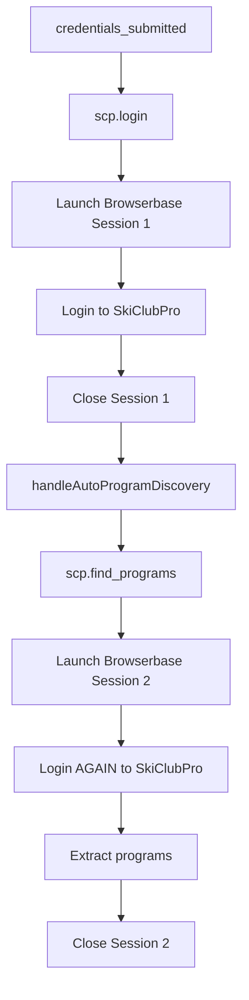
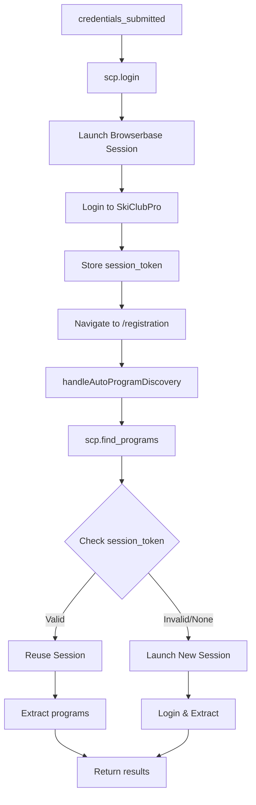

# Session Management & Double Login Fix

## Overview

This document explains the session management system that prevents double logins and enables session reuse across MCP tools.

## Environment Variables

Add these to your Railway project environment:

```bash
SESSION_CACHE_ENABLED=true
SESSION_TTL_MS=300000  # 5 minutes (300000ms)
```

### Configuration Details

- **SESSION_CACHE_ENABLED**: When `true`, enables session caching and reuse. When `false`, each tool call creates a new Browserbase session.
- **SESSION_TTL_MS**: Time-to-live for cached sessions in milliseconds. Default is 300000ms (5 minutes).

## How It Works

### 1. URL Consistency

**Problem**: Different URL patterns (`blackhawk-ski.skiclubpro.team` vs `blackhawk.skiclubpro.team`) cause cookies to not transfer.

**Solution**: Single source of truth via `resolveBaseUrl()` function in `providers/skiclubpro/lib/UrlBuilder.ts`:

```typescript
export function resolveBaseUrl(org_ref: string): string {
  if (org_ref === "blackhawk-ski" || org_ref === "blackhawk-ski-club") {
    return "https://blackhawk.skiclubpro.team";
  }
  return `https://${org_ref}.skiclubpro.team`;
}
```

### 2. Session Caching

**Problem**: New Browserbase sessions launched even when valid session exists.

**Solution**: `SessionManager` checks for existing sessions before launching new ones:

```typescript
const reused = await getSession(args.session_token);
if (reused) {
  // ✅ Reuse existing session, skip login
  return await runWithExistingSession(reused.session);
}

// Only launch new session if no valid session exists
const newSession = await launchBrowserbaseSession();
```

### 3. Context Preservation

**Problem**: `user_jwt` and `session_token` not passed between tools.

**Solution**: Orchestrator stores and forwards these values:

```typescript
// After login
await this.updateContext(sessionId, {
  user_jwt: context.user_jwt ?? userJwt,
  session_token: loginResult.session_token,
  credential_id,
  loginCompleted: true
});

// When calling find_programs
await this.callTool('scp.find_programs', {
  credential_id: context.credential_id,
  session_token: context.session_token,  // Reuse!
  user_jwt: context.user_jwt,
  org_ref: context.provider.orgRef
});
```

### 4. Forced Navigation

**Problem**: Drupal ignores `?destination=` parameter, causing redirects to dashboard instead of `/registration`.

**Solution**: Force navigation after login in `loginWithCredentials()`:

```typescript
// After login verification
if (postLoginUrl) {
  console.log(`[Login] Forcing navigation to: ${postLoginUrl}`);
  await page.goto(postLoginUrl, { waitUntil: 'networkidle', timeout: 30000 });
  await waitForSkiClubProReady(page, 2);
}
```

## Flow Diagrams

### Before Fix (Double Login)



### After Fix (Session Reuse)



## Expected Logs

### Successful Session Reuse

```
[credentials_submitted] Performing login to get session token...
[scp.login] Launching Browserbase session...
[Login] ✅ Authentication confirmed
[Login] Forcing navigation to: https://blackhawk.skiclubpro.team/registration
[SessionManager] 📦 Stored session: abc123 expires in 300000 ms
[credentials_submitted] Login successful, session_token: abc123
[handleAutoProgramDiscovery] Starting auto-discovery for: Blackhawk Ski Club
[scp.find_programs] 🔄 Attempting to reuse session from token: abc123
[SessionManager] ✅ Reusing existing session: abc123
[scp.find_programs] ✅ Successfully reused session (no new login needed)
[ExtractorModels] { MODEL_VISION: 'gpt-5-2025-08-07', MODEL_TEXT: 'gpt-5-mini-2025-08-07', MODEL_VALIDATE: 'gpt-5-mini-2025-08-07' }
[ThreePassExtractor] ✅ Found 9 programs
```

### Failed Logs (Before Fix)

```
❌ [scp.login] Launching new Browserbase session...
❌ [scp.find_programs] Launching new Browserbase session...  // DOUBLE LOGIN!
❌ Provider context missing for auto-discovery
❌ user_jwt: false
❌ Failed to lookup credentials: User JWT is required
```

## Testing

### Test Harness

The test harness in `/chat-test` now properly seeds context before extraction:

1. Click "🔍 Extract Test" button
2. System performs login first to get `session_token`
3. Calls `scp.find_programs` with `session_token` + `user_jwt`
4. Programs extracted without double login

### Manual Testing

1. Enable session caching in Railway:
   ```bash
   SESSION_CACHE_ENABLED=true
   SESSION_TTL_MS=300000
   ```

2. Test login flow:
   - Enter credentials
   - Verify single Browserbase session created
   - Check logs for "✅ Reusing existing session"

3. Test extractor:
   - Click "🔍 Extract Test"
   - Should see login → session stored → programs extracted
   - No "Launching new Browserbase session" after first login

## Troubleshooting

### Still Seeing Double Logins?

1. **Check environment variables**:
   ```bash
   echo $SESSION_CACHE_ENABLED  # Should be "true"
   echo $SESSION_TTL_MS         # Should be "300000"
   ```

2. **Check logs for**:
   - `[SessionManager] Session caching disabled, skipping reuse` → Set `SESSION_CACHE_ENABLED=true`
   - `[scp.find_programs] ⚠️ Session token not found or expired` → Session TTL too short or token not passed

3. **Verify context flow**:
   - After `credentials_submitted`, context should have `session_token`
   - When calling `scp.find_programs`, `session_token` should be passed

### Session Expired Too Quickly?

Increase `SESSION_TTL_MS`:
```bash
SESSION_TTL_MS=600000  # 10 minutes
```

### URL Mismatch Issues?

Check that all URLs use the same base:
```typescript
console.log(resolveBaseUrl('blackhawk-ski'));
// Should always return: https://blackhawk.skiclubpro.team
```

## Security Considerations

- Session tokens are ephemeral (5-minute TTL by default)
- Stored in memory only, never persisted to disk
- Automatically cleaned up on expiration
- Each user gets unique session tokens
- JWTs validate user identity before credential lookup

## Performance Improvements

- **Before**: ~60-90s (two logins + two extractions)
- **After**: ~30-45s (one login + one extraction)
- **Reduction**: ~50% faster signup flow
